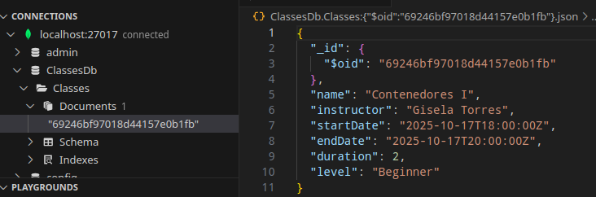
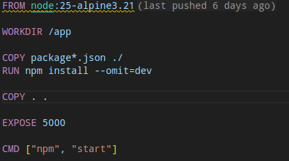
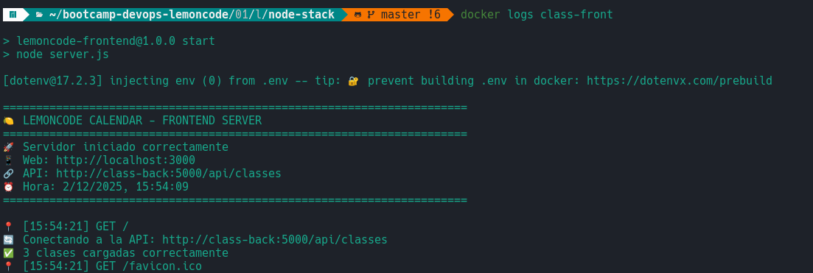
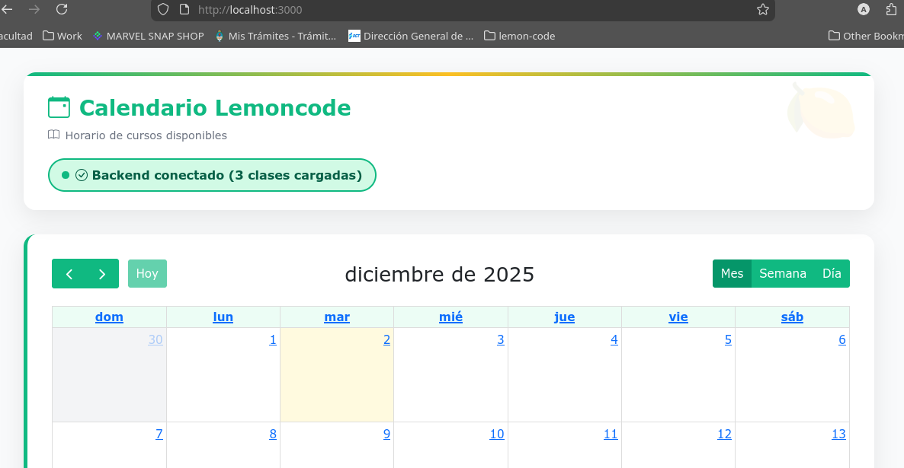

## Reto 1: Dockerizar MongoDB

---

#### Comando para crear y ejecutar el contenedor de MongoDB

```bash
docker run -d \
  --name mongodb \
  -p 27017:27017 \
  -e MONGO_INITDB_ROOT_USERNAME=admin \
  -e MONGO_INITDB_ROOT_PASSWORD=admin123 \
  -v mongo_data:/data/db \
  mongo:latest
```

---

#### Configuración de conexión del backend a MongoDB

- Le agregue a la variable global el username y password


- Levantando el servidor backend localmente:


---

### Prueba REST Client

- Se enviaron 2 request desde el `client.http` al contenedor del mongodb
- En la primera imagen vemos los datos persistidos dentro del contenedor mediante un POST, en la segunda es el GET de todas las clases.




## Reto 2: Dockerizar backend

#### Crear un Dockerfile



#### Construir la imagen usando el Dockerfile

- Para construir la imagen, ejecuto el siguiente comando:

  ```bash
  docker build -t classes-backend:0.0.1 .
  ```

#### Verificar conexion con MongoDB container

- Para ello, lo que hice fue crearme una network y luego crear el contenedor de la imagen del backend, ademas de asignarle la network al mongodb container.

  ```bash
  docker network create db-back

  docker run -d --name class-back --network db-back -p 5000:5000 class-back:0.0.1
  ```

## Reto 3: Dockerizar FrontEnd

#### Crear un Dockerfile para el frontend


---

#### Construir la imagen usando el Dockerfile

- Para construir la imagen, ejecuto el siguiente comando:

  ```bash
  docker build -t classes-frontend:0.0.1 .
  ```

---

#### Ejecutar el frontend en un contenedor en la red Docker

- Para ello me creo una nueva network:

  ```bash
  docker network create back-front
  ```

- Luego conecto el nuevo network al backend:

  ```bash
  docker network connect back-front class-back
  ```

- Ejecutoe contenedor del frontend:

  ```bash
  docker run -d --name class-front --network back-front -p 3000:3000 class-front:0.0.1
  ```

---

#### Configurar las variables de entorno para conectarse al backend en http://class-back:5000/api/classes

## 

#### Acceder a la interfaz desde el navegador en el puerto 3000



---

## Reto 4: Docker Compose

#### Todos los servicios corriendo (docker-compose ps)


---

#### Captura del docker-compose levantado:


